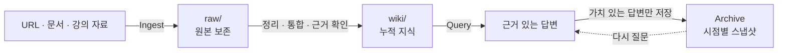

# MJ LLM Wiki

> 원본은 그대로, 지식은 서로 연결하고, 좋은 답변은 다시 꺼내 쓸 수 있게.

개발하면서 읽고 배운 내용을 LLM과 함께 축적하는 개인 지식 저장소입니다. 링크와 강의 자료를 단순히 모아 두는 데서 끝내지 않고, 원본에 근거한 문서로 통합한 뒤 질문과 답변에 다시 활용합니다.

2026-09-29 현재 **15개 주제**, **85개 지식 문서**, **29개 답변 Archive**, **295개 원본 자료**가 연결되어 있습니다.

[지식 전체 보기](wiki/index.md) · [운영 기록 보기](wiki/log.md) · [Wiki 사용법](wiki/llm-wiki/karpathy-llm-wiki-workflow.md)

## 지식이 쌓이는 구조



| 영역 | 역할 | 변경 원칙 |
|---|---|---|
| [`raw/`](raw/) | URL, 스크립트, PDF 등 수집한 원본 | 새 자료만 추가하며 저장된 원본은 수정하거나 삭제하지 않습니다. |
| [`wiki/`](wiki/) | 여러 원본에서 재사용할 지식을 정리한 문서 | 새 근거가 들어오면 내용을 통합하고 관련 문서까지 갱신합니다. |
| Archive | 특정 질문에 대한 답변을 보존한 `wiki/` 문서 | 기존 Wiki를 근거로 만들며 시점별 스냅샷으로 유지합니다. |
| [`wiki/index.md`](wiki/index.md) | 모든 지식 문서의 탐색 허브 | 주제별 문서, 요약, 최근 갱신일을 한곳에서 관리합니다. |
| [`wiki/log.md`](wiki/log.md) | Ingest, Query, Lint 이력 | 어떤 자료가 어떤 지식으로 이어졌는지 시간순으로 기록합니다. |

## 지금까지 다룬 주제

| 주제 | 담고 있는 내용 |
|---|---|
| [AI Agents](wiki/ai-agents/) | Agent harness, Git worktree, Claude Code, skill과 사람-AI 협업 방식 |
| [Software Career](wiki/software-career/) | AI 시대의 성장 전략, 개발 흐름, 설계 문서와 작업 분해 |
| [Spring](wiki/spring/) | Spring Boot 입문부터 MVC, DI, DB 접근, JPA·Hibernate와 AOP까지 |
| [Database](wiki/database/) | PK·FK·복합 키, 정규화, 참조 무결성과 MySQL 실행 계획 |
| [Kotlin](wiki/kotlin/) | 기본 문법, 함수형 표현, 객체지향 구성과 안전성 규칙 |
| [IntelliJ](wiki/intellij/) | macOS 단축키와 코드 탐색·정리 |
| [Orca](wiki/orca/) | Worktree 중심 실행 모델, CLI, orchestration과 검토 흐름 |
| [UX](wiki/ux/) | 비디자이너를 위한 UX 학습과 디자인 레퍼런스 활용법 |
| [Docker](wiki/docker/) | Image, container, Compose, 보안과 운영 원칙 |
| [Frontend](wiki/frontend/) | C4 기반 아키텍처 시각화, Web 성능 구조와 Orval 기반 OpenAPI 클라이언트 생성 |
| [Git](wiki/git/) | Worktree와 GitLab tag 기반 배포 workflow |
| [SEO](wiki/seo/) | Canonical URL과 Next.js metadata 구현 |
| [Web Security](wiki/seo/web-security/) | Content Security Policy의 원리와 적용 기준 |
| [Statistics](wiki/statistics/) | 데이터 분포, percentile과 percentage 해석 |
| [LLM Wiki](wiki/llm-wiki/) | 이 저장소 자체의 질문·Ingest·Archive 운영법 |

문서별 요약과 갱신일은 [Knowledge Base Index](wiki/index.md)에서 확인할 수 있습니다.

## 이렇게 사용합니다

이 저장소는 명령어를 외워서 쓰는 도구가 아니라, 자연어로 질문하고 지식을 키우는 작업 공간입니다.

### 1. 먼저 질문하기

```text
내 Wiki를 기준으로 AI agent harness의 핵심 구성 요소를 설명해줘.
```

기존 `wiki/`를 먼저 검색해 답합니다. 관련 지식이 없으면 없다고 알리며, 요청하지 않은 외부 조사는 시작하지 않습니다.

### 2. 새 자료 넣기

```text
이 URL을 ingest해서 기존 Docker 문서에 통합해줘: <URL>
```

원본은 `raw/`에 보존하고, 새 내용인지 기존 문서의 갱신인지 판단해 `wiki/`에 반영합니다. 기존 주장과 충돌하면 덮어쓰지 않고 상태와 근거를 함께 남깁니다.

### 3. 여러 자료 조사하기

```text
공식 자료를 조사해서 Kotlin coroutine 주제를 Wiki에 추가해줘.
```

외부 조사는 명시적으로 요청한 경우에만 진행합니다. 핵심 주장뿐 아니라 반대 근거와 한계도 함께 살핍니다.

### 4. 좋은 답변 남기기

```text
방금 답변을 Archive해줘.
```

계속 참고할 가치가 있는 답변만 `wiki/`에 새 스냅샷으로 보존합니다. Archive는 원본 자료가 아니라, 당시 Wiki를 바탕으로 내린 결론입니다.

## 신뢰할 수 있는 Wiki를 위한 원칙

- **원본 보존**: `raw/`에 들어온 자료는 수정하거나 삭제하지 않습니다.
- **근거 추적**: 일반 Wiki 문서의 날짜, 수치, 인용은 연결된 원본에서 확인할 수 있어야 합니다.
- **통합 우선**: 같은 주제의 파일을 계속 늘리기보다 기존 문서에 지식을 합칩니다.
- **변경 이력 보존**: 새 자료가 기존 주장을 대체하거나 반박하면 `Outdated` 또는 `Disputed` 상태로 맥락을 남깁니다.
- **선택적 Archive**: 모든 대화를 저장하지 않고 다시 쓸 가치가 있는 답변만 보존합니다.
- **검사 가능한 구조**: Index, 내부 링크, 원본 참조와 근거 일치 여부를 Lint로 점검합니다.

## 저장소 둘러보기

```text
MJ-LLM-Wiki/
├── raw/                 # 변경하지 않는 원본 자료
│   └── <topic>/
├── wiki/                # 정리·통합된 지식과 Archive
│   ├── index.md         # 전체 탐색 허브
│   ├── log.md           # 작업 이력
│   └── <topic>/
├── AGENTS.md            # 저장소 운영 규칙
└── README.md
```

Obsidian에서는 저장소 루트를 Vault로 열면 Markdown 링크를 따라 문서를 탐색할 수 있습니다. 가장 좋은 출발점은 [`wiki/index.md`](wiki/index.md)입니다.

---

이 Wiki의 목표는 많이 저장하는 것이 아닙니다. **원본으로 돌아갈 수 있고, 새 지식과 함께 자라며, 다음 질문을 더 좋게 만드는 문서**를 남기는 것입니다.
